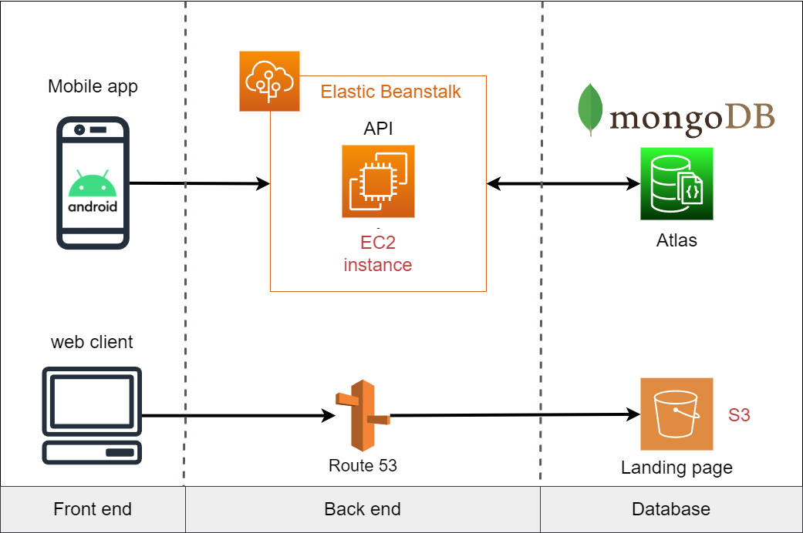
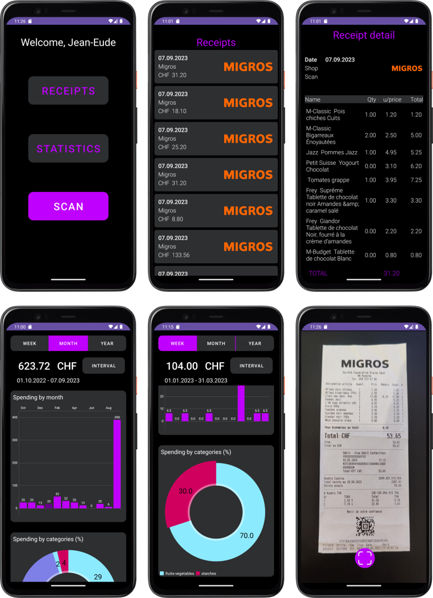

# scanalyze

Scanalyze is a group project developed as part of the PDG module at the HEIG-VD Engineering school. The project was
initiated by Anthony David, Jarod Streckeisen and Timothée Van Hove.

> [!IMPORTANT]  
> This project is no longer maintained. All services have been shut down and all data associed to them have been erased.
> The website and API are no longer working, in consequence, the Android app is no longer functionnal as it relies on the API.

## Description

Are you tired of losing track of your grocery expenses or wondering where your money goes every month? Say hello to the
future of grocery budgeting! Our app revolutionizes the way you manage your grocery spending, all at your fingertips.

Simply snap a photo of your grocery receipt using your smartphone. Our OCR technology will accurately read the receipt
and extract all the important details in seconds. No manual input, no fuss. View real-time summaries, detailed expense
categories, and insightful charts that help you understand your spending habits. Our app empowers you to make
data-driven decisions that could save you money in the long run.

By knowing exactly where your money is going, you can set achievable budget goals and celebrate when you meet them. Make
every grocery trip a winning experience!

## Architecture overwiew

Scanalyze is designed as a multi-tiered application involving client-side, server-side, and database components. Each of
these elements has specialized tasks and together they form a cohesive ecosystem for effective grocery expense tracking.

## Android app

The mobile application serves as the user interface and is responsible for capturing grocery receipts through the
device's camera. It utilizes Optical Character Recognition (OCR) to extract textual data from these receipts. The app
also handles user authentication and data visualization through various graphs and charts. Want to learn
more? [Check this out](android_app/README.md).

**Key Features:**

- Receipt scanning
- Data visualization with charts
- Receipt history

## Web Server

The web server acts as the intermediary between the mobile application and the database. The server processes the OCR
data received from the mobile application and feeds the database. It is the server responsibility to link (index) the
abbreviated products on the receipt to the existing product in the database. Additionally, the server leverages user
data from the database to generate statistics, which are made accessible to the mobile application via its API. The
server also manages user authentication tokens. Want to learn more? [Check this out](backend/README.md)

**Key Features:**

- Data processing and analysis
- Receipt - database indexation
- API endpoints for client-server communication

## Database

The database stores detailed information about various grocery products, including their descriptions, categories, and
indicative prices. This data is queried by the web server whenever a new grocery receipt is processed.Want to learn
more? [Check this out](database/README.md)

**Key Features:**

- Storage of product descriptions and categories
- User data management
- Scalable data schema

## Scraper

Application that scrapes data from Coop, Migros, Aldi and Lidl stores to feed the database.

Documentation :

- [How to run](scraper/README.md)
- [documentation](scraper/SCRAPER.md)

## How to launch the project locally

### Android app

Simply visit the application on scanalyze.ch and download the apk file directly to your Android phone. To install it,
just click on install and you're ready to go.

### Backend

please refer to this [documentation](backend/README.md)

## Contribute to the project

We appreciate your interest in contributing to our project! However, please note that we are currently not accepting
contributions from outside our development team. Here's why:

1. **Project Maturity**: The project is in a nascent stage, with various core features still under development. Until it
   reaches a more mature state, we are limiting contributions to our internal team.
2. **Management Constraints**: As a student-run project, we have limited time and resources to manage pull requests and
   issues from external contributors.
3. **Hosting Limitations**: Parts of our project are hosted on AWS Elastic Beanstalk. Given that we are currently
   funding this out of pocket, we are not yet prepared to deploy the infrastructure for public usage.
4. **Incomplete Features**: Account management, among other features in the Android app, are not fully implemented. We
   believe that opening the project up for contributions at this stage could lead to unnecessary complexity.

We understand the enthusiasm and interest to contribute, and we do plan on making the repository publicly accessible for
contributions once it's mature and we are ready to manage it efficiently. If you have any questions or would like to be
notified when we are accepting external contributions, feel free to contact us.

Thank you for understanding.

Contacts :

Anthony David : anthony.david@heig-vd.ch

Jarod Streckheisen : jarod.streckeisen@heig-vd.ch

Timothée Van Hove : timothee.vanhove@heig-vd.ch

