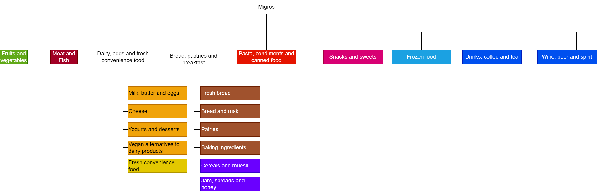

# CATEGORIZATION

## Categories

In order to provide the user of the application with the ability to track their purchases by categories, we have defined a list of categories.

- Fruits et légumes "fruits-vegetables"
- Viandes et poisson "meat-fish"
- Boissons "drinks"
- Produits laitiers et oeufs "dairies-eggs"
- Pain et patisseries "bread"
- Déjeuner "breakfast"
- Congelés "frozen"
- Plats préparés "convenience"
- Snacks et sucrerie "snacks"
- Pâtes, condiments et conservers "starches"
- Autres "others"

## Category management by store
We've created a color scheme for each category, and the diagrams represent the tree structure of the websites.

The choice of categories is arbitrary and up to the developer.
### Migros

### Coop

### Aldi
Since the pages of the website practically correspond to our categories, we didn't schema them. However, here's which url corresponds to which category:
- boissons-non-alcoolisées : "drinks"
- boissons-alcoolisées : "drinks"
- pain-&-produits-boulangers : "bread"
- viande-&-poisson : "meat-fish"
- déjeuner : "breakfast"
- rayon-frais : "convenience"
- produits-laitiers-et-œufs : "dairies-eggs"
- fruits-&-légumes : "fruits-vegetables"
- produits-surgelés : name": "frozen"

### Lidl
Architecture different from other websites. Ability to scrape everything at once. Consequently, we haven't integrated categories for the time being.

## Note
It's important to understand that the choice of categories is made by the developer and essentially depends on the website's tree structure. It's not totally out of the question for a product not to be found in several categories, or in none at all. It's also not impossible for a product not to appear in one category for a given store and in another for another store.

The choice of categories should be optimized if the project continues to exist after the end of the course PDG.